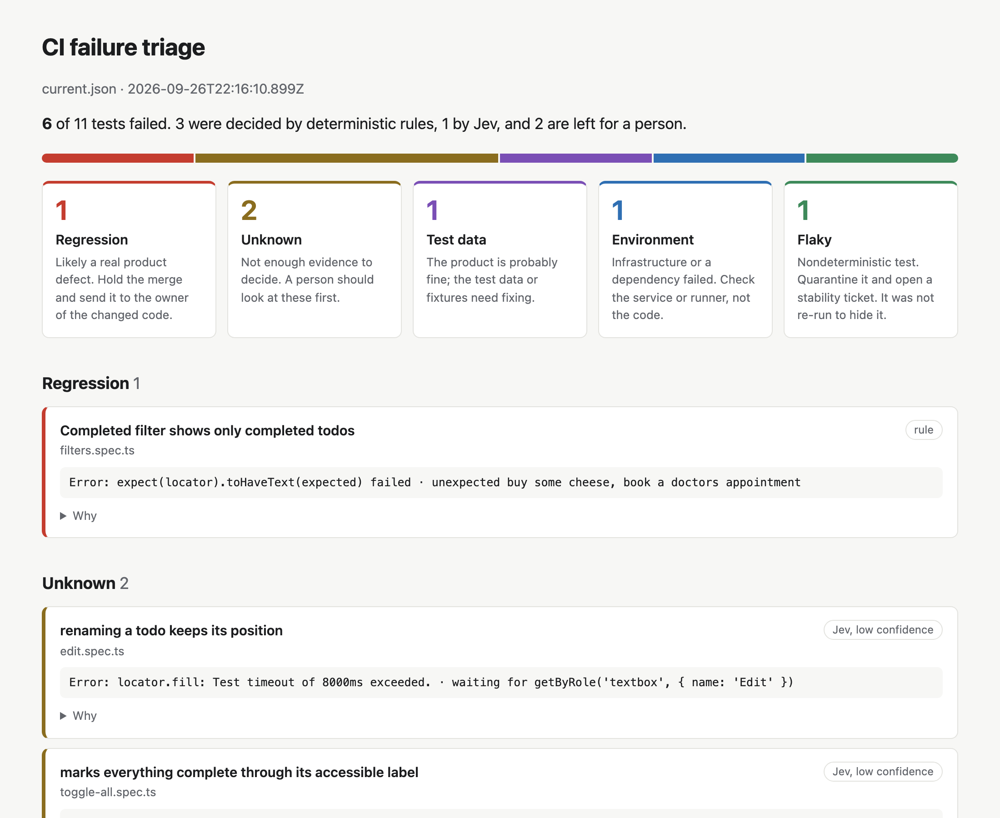
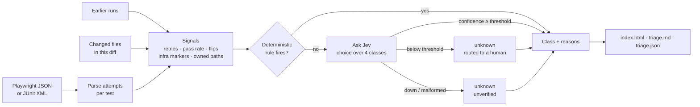

# jev-ci-triage

**CI failure triage for Playwright and JUnit suites.** Every failing test is sorted into one of five classes before anyone opens a stack trace:

| Class | What it means | What to do |
| --- | --- | --- |
| **regression** | The product changed behaviour | Hold the merge, send to the owner of the changed code |
| **flaky** | Same code, different outcome | Quarantine and open a stability ticket |
| **environment** | Network, a dependency, the runner | Check infrastructure, not the code |
| **test-data** | Fixtures or seed data are wrong | Fix the data, the product is probably fine |
| **unknown** | Not enough evidence | A person looks at these first |

Deterministic rules decide whatever they can. [Jev](https://docs.typesafe.ai) (TypeSafe AI) is only asked about the failures the rules can't decide. The tool **never re-runs a test, never skips one and never turns a red build green.** It reads the retries your CI already did and adds a label to each failure. The build status doesn't change.

**Live sample report:** https://criguex.github.io/jev-ci-triage/ (regenerated by CI on every push)



---

## Why

A red pipeline gives you a list of questions, and only some of them are bugs. The usual first hour of the morning goes like this: open each failure, decide whether it's the product, the test, the data or the network, and ping the right person. That work is repetitive and people do it inconsistently. It's also the step that gets skipped when there's a deadline. Teams then tend to go one of two bad ways:

- **Retry until green.** The pipeline goes quiet and real regressions go out with it.
- **Treat every red as a bug.** Developers stop trusting the suite.

This tool does the sorting and leaves the judgement to a person. Each label comes with the evidence behind it, so the reviewer only has to confirm or overrule it.

## How it works



**Rules, in order** (`src/classifier.ts`):

1. Failed and then passed on a retry in the same run → **flaky**.
2. Infrastructure marker (`ECONNREFUSED`, `ECONNRESET`, DNS, `net::ERR_*`, 502/503/504, browser crash, navigation timeout, runner out of memory or disk) and none of the test's own application code changed → **environment**. A plain 500 doesn't count as infrastructure, because it's often the app's fault.
3. At least `minHistory` earlier runs, outcome flipped at least twice, pass rate strictly between 0 and 1 → **flaky**.
4. Passed on every one of at least `minHistory` earlier runs, fails every attempt now, the diff touches application code this test owns, the diff doesn't touch the test or its data, and there are no infrastructure markers → **regression**.
5. Anything else is **ambiguous** and goes to Jev.

Test-data is never decided by a rule. Telling "the fixture changed" apart from "the product changed" is a question about meaning, and that's the part Jev handles.

**Jev** gets a compact, redacted state for each ambiguous failure: the error, the top stack frames, attempts, a history summary, changed files and markers. It's asked two typed questions: a `choice` over the four decidable classes and a `noul` for "would this pass if re-run unchanged?". The second is shown to the reader and never used to decide anything. Jev returns probabilities, not prose, so there's no free text to parse and nothing invented to act on.

**Ownership** maps each test to the code it covers (`demo/jev-triage.config.json` is the example). Without it the tool falls back to broad globs. That's more conservative: fewer regressions get decided by rules and more failures go to Jev or a person.

**Redaction** (`src/redact.ts`) removes bearer tokens, `key=`/`token=`/`password=` values, provider-style keys, JWTs, emails, card-like numbers and home-directory paths before anything is sent.

## Honest limits

- **Jev can pick a wrong option that is still valid.** It always answers with one of the options it was given. In this demo it leaned *flaky* (0.69 to 0.84 confidence) for a new test written for a feature the build doesn't have. That's a plausible guess and it's wrong. The threshold is what kept it away from a verdict.
- **Confidence is self-reported and only used for routing.** It decides whether an answer is shown as a verdict or sent to a person. It isn't a measured accuracy. For the same input it moved between calls (see the measurements), so a case right at the threshold can land on either side on different days.
- **Rules need history.** With fewer than `minHistory` runs (default 5) the rules step back and the case goes to Jev or a person. New tests will show up as *unknown* more often, and that's intended.
- **The demo is small.** 6 seeded failures isn't a benchmark. The numbers below show that the pipeline works end to end. They don't measure accuracy on your suite, and the threshold (0.75) is a starting point to tune on your data.
- **Jev is a hosted service.** State leaves the machine, redacted, but it does leave. When the service is down or rate-limited, ambiguous failures are reported as `unknown · unverified`, with the HTTP status and response body kept in the report. The tool doesn't guess.

## Measured in this repo

Everything below comes from running this repository. There's nothing else in it.

**Demo triage** (`npm run demo:triage && npm run demo:eval`, live Jev via Vercel AI Gateway, then replayed offline in CI):

| Failing test | Seeded as | Tool said | Decided by |
| --- | --- | --- | --- |
| Completed filter shows only completed todos | regression | regression | rule |
| backup service answers its health check | environment | environment | rule |
| counter reflects a completed item right away | flaky | flaky | rule |
| seeded shopping list renders in order | test-data | test-data (1.00) | Jev |
| marks everything complete through its accessible label | regression | unknown, Jev leaned regression 0.61 | Jev, below threshold |
| renaming a todo keeps its position | unknown | unknown, Jev leaned flaky 0.69 | Jev, below threshold |

That's 5 correct, 1 correctly handed to a person that could have been decided, and 0 wrong, out of 6. 3 of the 6 never reached Jev.

**Jev calls** (recorded run and `scripts/measure.ts`; the raw data is in `demo/measurements/jev-repeatability.json`):

MEASUREMENTS_PLACEHOLDER

## Quick start

```bash
npm ci
npm test                  # unit tests: classifier, signals, parsers, Jev normalizer, fail-open
npm run demo:triage       # offline: replays recorded Jev answers → report/index.html
npm run demo:eval         # compares the report with the seeded ground truth
```

With a key (Vercel AI Gateway `AI_GATEWAY_API_KEY`, or `TYPESAFE_API_KEY` for direct access) in `.env`:

```bash
npm run triage -- --results demo/runs/current.json --history demo/runs/history \
  --changed-files demo/scenario/changed-files.txt --config demo/jev-triage.config.json \
  --out report --jev live
```

Re-create the demo runs from scratch (8 baseline runs, then the candidate build):

```bash
npx playwright install chromium
npm run demo:record
```

### The demo

`demo/` holds a small TodoMVC app and an 11-test Playwright suite. The app uses the same DOM as the public [demo.playwright.dev/todomvc](https://demo.playwright.dev/todomvc), so the same suite runs against both:

```bash
BASE_URL=https://demo.playwright.dev/todomvc/ npm run demo:suite   # 10 passed, 1 skipped
```

The app ships locally for one reason: a regression has to be a real change to code, and nobody can push a bug to a public site. The `candidate` scenario serves the files in `demo/candidate/` over the app and uses an edited fixture. `demo/scenario/ground-truth.json` explains what each seeded failure is:

- **regression**: `filters.js` also counts long titles as completed; `index.html` breaks the label of *Mark all as complete*
- **flaky**: the counter updates after a random 0 to 300 ms delay and the test reads it once after 120 ms
- **environment**: the backup service URL points to a port where nothing is listening
- **test-data**: the shopping-list fixture was edited
- **unknown**: a new test for inline editing, which this build doesn't implement

Recording note: the candidate run is repeated until the flaky test fails its first attempt (see `demo/scripts/record-runs.sh`), so that the sample shows all five classes.

## Use it in your pipeline

```yaml
- uses: actions/checkout@v4
  with: { fetch-depth: 0 }
- run: npx playwright test
  continue-on-error: true
  id: e2e
- uses: criguex/jev-ci-triage@main
  if: always()
  with:
    results: test-results/results.json      # Playwright json reporter, or a JUnit XML
    history: .triage-history                # earlier results you keep, e.g. via actions/cache
    config: .github/jev-triage.config.json
    fail-on: regression,unknown
    api-key: ${{ secrets.AI_GATEWAY_API_KEY }}
- if: steps.e2e.outcome == 'failure'
  run: exit 1                               # the suite's own verdict still stands
```

On pull requests the action works out the changed files from the base branch. The Markdown summary is written to the job summary. `fail-on` can make the step fail for certain classes, but it can never make it pass.

CLI flags: `--results`, `--history`, `--changed-files`, `--config`, `--out`, `--jev auto|live|record|replay|off`, `--fixtures`, `--fail-on`.

## Layout

```
src/
  parsers/        Playwright JSON and JUnit XML → attempts per test
  signals.ts      history, flips, infra and data markers, owned changed paths
  classifier.ts   deterministic rules
  jev/            transports (live, record, replay, off), normalizer, questions
  engine.ts       rules → Jev → routing, fail-open
  report/         HTML, Markdown
tests/            vitest unit tests
demo/             app, suite, recorded runs, recorded Jev answers, ground truth
scripts/          eval against ground truth, repeatability measurement
action.yml        composite GitHub Action
```

## Service

I set this up on client pipelines as a fixed-scope engagement, with optional monthly upkeep.

**Setup**
- Connect it to your CI (GitHub Actions, GitLab CI, Azure Pipelines, Jenkins) and your reports (Playwright, JUnit from Jest, Vitest, pytest, Maven or Gradle).
- Keep run history so the rules have data to work with.
- Write an ownership map that links tests to the code they cover, which is what makes regression calls reliable.
- Calibrate against your recent failures: label a sample by hand, compare, and set the confidence threshold from what we measure.
- Adjust redaction and data handling to your compliance needs. Jev can be switched off completely and the tool still runs on rules only.
- Deliver the report where your team already looks: job summary, PR comment, a Slack or Teams message, or a Jira ticket.

**Monthly**
- A monthly review of the triage decisions against what actually happened, with threshold and rule tuning.
- Flaky-test quarantine list and stability backlog, with root causes for the worst offenders.
- Upkeep when your stack, runners or the Jev API change.

What you won't get: auto-retries, auto-skips or anything else that hides a failure.

Contact: [Upwork](https://www.upwork.com) (Cristian Guerra, QA Automation) or GitHub [@criguex](https://github.com/criguex).

---

## En español

**Qué es:** una herramienta que clasifica cada prueba que falla en CI como *regression*, *flaky*, *environment*, *test-data* o *unknown*. Primero aplica reglas deterministas: reintentos del mismo run, tasa de éxito y cambios de resultado en el historial, marcadores de infraestructura y cruce del diff con el código que cubre cada prueba. Solo consulta a Jev (TypeSafe AI) en los casos ambiguos. **Nunca re-ejecuta ni oculta un fallo**: etiqueta y explica, y el estado del pipeline queda igual.

**Cómo leer el reporte:** cada fallo trae su clase, quién la decidió (regla o Jev) y el porqué. Cuando Jev responde con confianza por debajo del umbral (0.75 por defecto), el fallo queda como *unknown* y va a una persona, mostrando hacia dónde se inclinaba Jev. Si Jev no está disponible, queda *unknown · unverified* con el error HTTP completo. No se adivina.

**Límites:** Jev siempre elige una de las opciones que le das, así que puede elegir una válida pero equivocada. La confianza la reporta el propio modelo, varía entre llamadas con la misma entrada y aquí solo se usa para decidir qué va a revisión humana. La demo tiene 6 fallos sembrados: sirve para mostrar el flujo completo y no es un benchmark. Los números de arriba son los que medí en este repositorio.

**Servicio:** instalación en tu pipeline (CI, formatos de reporte, historial, mapa de ownership, calibración del umbral con tus fallos reales, redacción de datos y entrega del reporte donde tu equipo ya mira) y, si lo quieres, mantenimiento mensual (revisión de decisiones, cuarentena de flaky y ajustes). Contacto por Upwork o GitHub [@criguex](https://github.com/criguex).

## License

MIT
